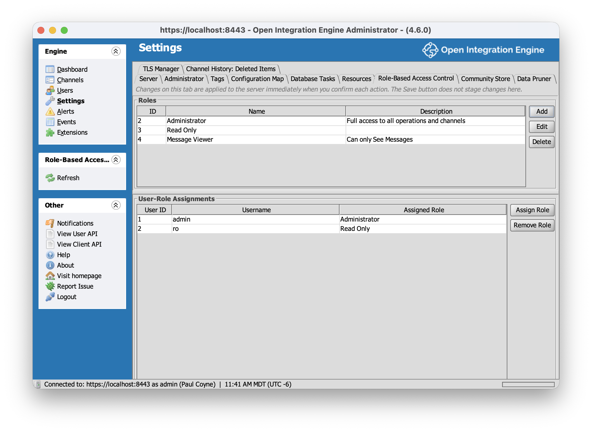
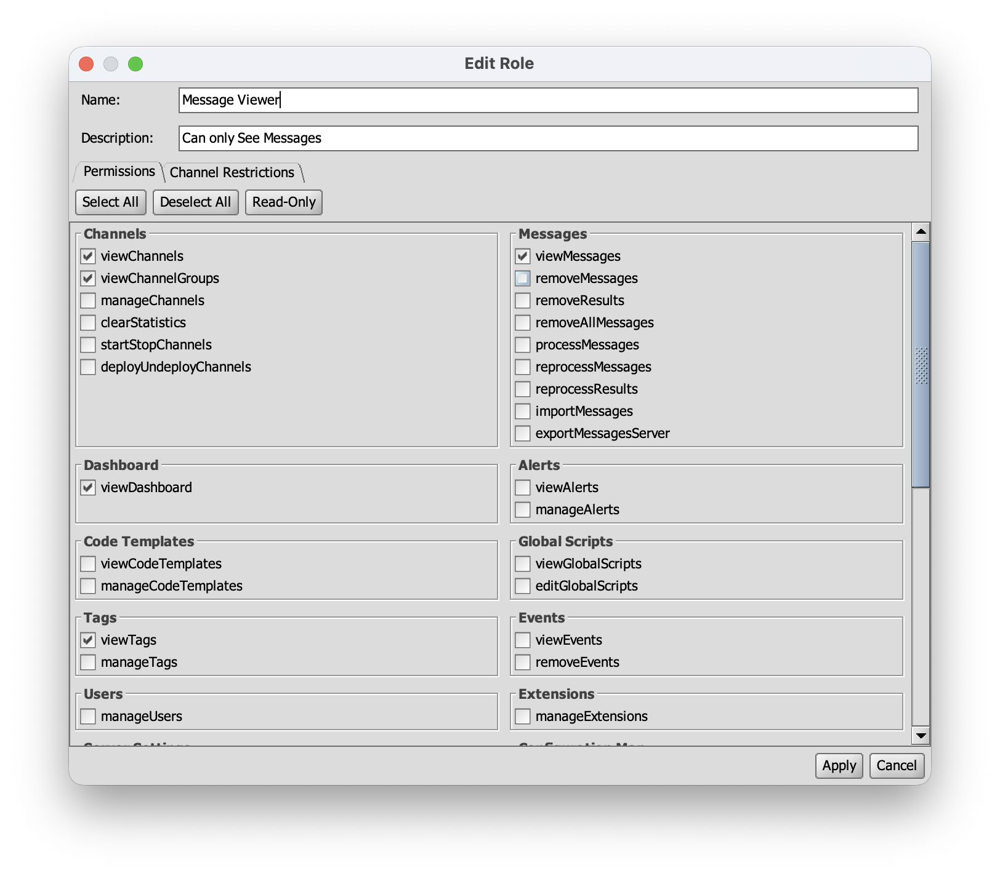

# Role Based Access Control for OIE

Role Based Access Control (RBAC) plugin for [Open Integration Engine](https://github.com/OpenIntegrationEngine/engine) 4.6.0. Enforces dynamic roles with per-permission grants and channel-level restrictions, replacing the engine's default always-allow authorization controller.

Web admin ready: the same zip ships both UIs. Role management and role-based task gating work in the desktop (Swing) Administrator and in the [OIE Web Administrator](https://github.com/diridium-com/role-based-access-control/wiki/Web-Administrator), with matching behavior in each. The web UI's permission gating is also more complete than Swing's, which cannot hide buttons inside panel bodies (an engine limitation that applies to all plugins); either way, denied operations always fail server-side. On servers where the Web Administrator isn't used, the web module is inert.

Full documentation is in the [wiki](https://github.com/diridium-com/role-based-access-control/wiki).





## Prerequisites

- JDK 17
- Maven 3.x
- A local checkout of the OIE engine source at version 4.6.0, built with its Gradle build (the plugin compiles against engine jars that are not published to a public Maven repository)
- Network access on the first build: the packaging step downloads Node.js v20.18.0 (via frontend-maven-plugin) to build the web administrator UI in `webadmin/`

## Build

First, install the engine jars into your local Maven repository. Build the engine checkout first so its jars exist, then run:

```bash
ENGINE_DIR=/path/to/engine ./scripts/install-engine-jars.sh
```

If `ENGINE_DIR` is unset, the script defaults to `../engine` relative to the repo.

Then build the plugin:

```bash
mvn clean install
```

Use `install`, not `package`. The multi-module build requires the shared module to be installed into the local repository for the sibling modules to resolve.

The distributable zip lands at:

```
package/target/rbac-1.1.2.zip
```

## Install

Install the zip through the Administrator's Extensions view and restart OIE. On first startup the plugin creates its four `rbac_*` tables and seeds an admin role assigned to the initial admin user.

## License

MPL-2.0. See [LICENSE](LICENSE).
